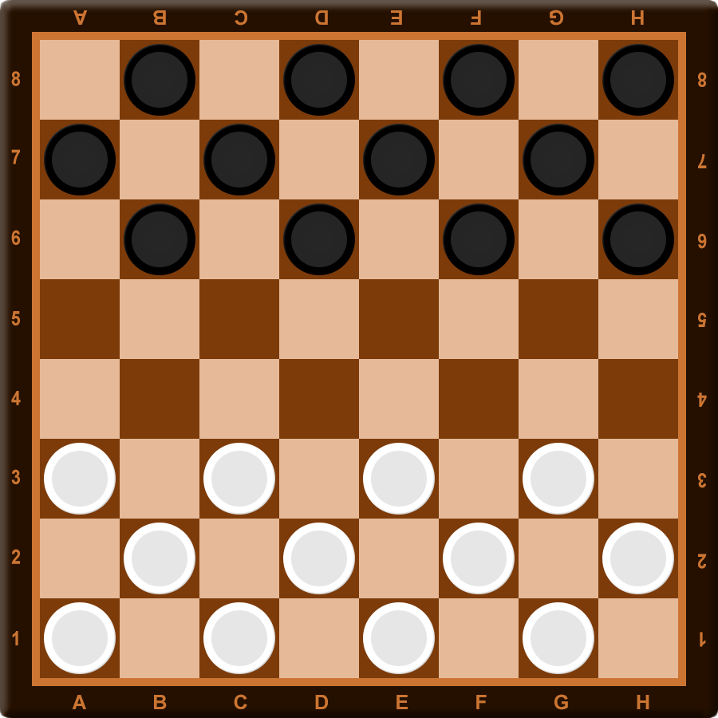

Описание приложения
===================

Постановка задачи
-----------------

Разрабатываем клиент северное приложение позволяющее играть в шашки по
сети. Каждый пользователь будет способен авторизовать (указать
уникальный логин) и сыграть партию в шашки с другим пользователем
приложения. Дополнительно будет возможность указать язык в клиентском
приложении.

Инструменты для решения задачи
------------------------------

В реализации севера предполагается возможность проводить одновременно
несколько партий, поэтому будет использован модуль asyncio. Для
реализации GUI клиентского приложения планируется использовать
библиотеку tkinter. Дополнительно для обеспечения возможности
параллельного взаимодействия как с пользователем, так и с сервером будет
использоваться модуль threading.

Интерфейс клиентского приложения
--------------------------------

   Окно авторизации

   Доска для игры
